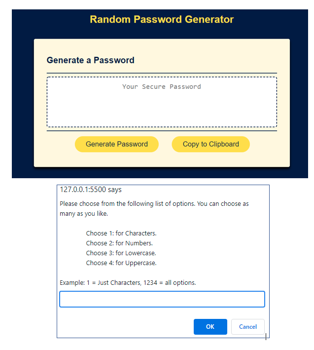
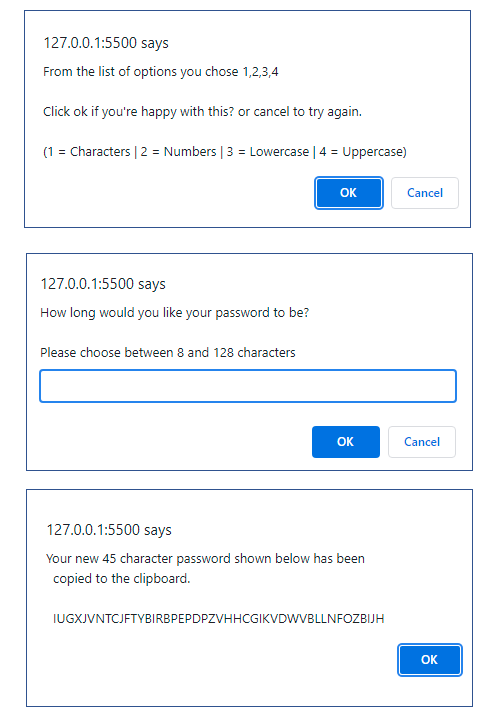
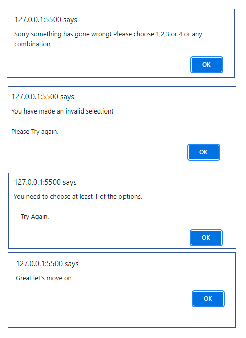
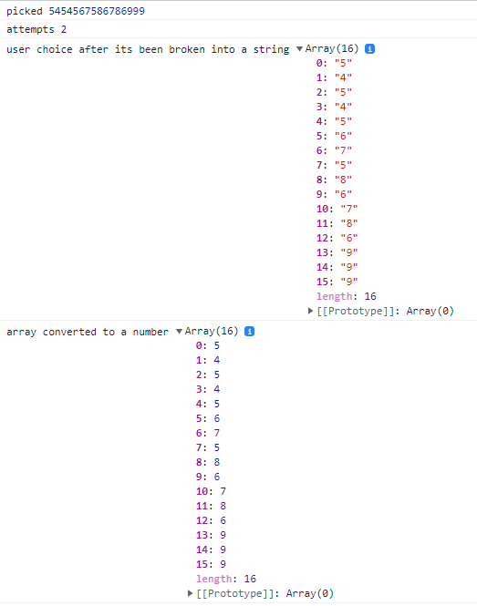
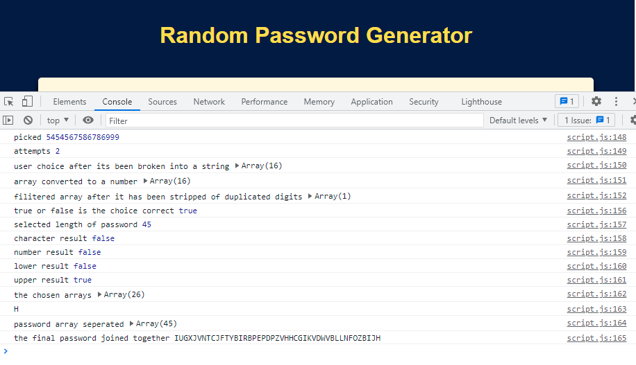

# randPassGenerator
link [Random Password Generator](https://daveydavey1901.github.io/randPassGenerator/)

**Description**
The project task was to create a random password generator. 
you had to:-
1. click a button to generate a random password.
2. you will be promoted to choose characters, numbers, lowercase, uppercase.
3. you will be promoted to choose the length between 8 and 128 characters.
4. you will be promoted to confirm choices.
5. at least one type must be chosen.
6. the function will generate the password matching choices. 
7. the password should be displayed on screen or in a prompt window.

**Approach**
on seeing this task i spent several days reviewing course material, jotting down Pseudocode, and then researching different ways to do this.  Many things i could not find or there was no clear explantion and it took a long time, a lot of reading and a lot of trials an errors before it all came together.  i knew there would be easier options as i heard what other students online tutors were recommending this was using tick boxs and input boxs... i chose to go down the hard road!! its more fun that way! i used just the one box to get the users choice for number, higher, lower, charctors because i wanted to minmize the amount of popups. in the end you get two prompts for information and two confirmations... there is several error alerts for the possible mistakes that could happen. 

in the visuals below you can see the steps in which the generator runs.  

1.  fig 1. image 1.. shows the look of the password generator modified style and added copy button.
  
2.  fig 1. image 2.. shows the first prompt window in which i presented you all 4 choices of which you were told you could choose 1 or 2 3 or all 4 options.
  
3.  fig 2. image 1.. if you entered a valid selection you are asked to confirm your selection and it is then shown in the text of the next alert  (this has been filitered for                        duplicates)
 
4.  fig 2. image 2.. if everything was ok you are then prompted to select between 8 and 128 characters.  your password is now created from your chosen options and displayed in                        the password generator window.
  
5.  fig 2. image 3.. if you then press the copy button you will see image three.  it shows the size of password you picked as well as the password itself and is now on your                          clipboard ready to be pasted.
  
6.  fig3. all these imagines you see on fig 3 are the various error messages you will get if you do not enter any information, enter letters, enter an invalid number. the last             image is the nicer one as it means you've done eveything correctly and can move on. the generater allows you to have three attempts to get it right before it gives up           on you.
 
**A bit about what the function is doing.**

The code visually..  on first sight does look a bit messey where the text for the alet, prompt and confirm boxes are... this is because ive used the `back tick` so how i typed   it in in the script will be how it will appear on the alert,prompt or confirm messages... this means it may not be indented at all and all the way to the left... i find using the `back tick a better option than +.

1.  fig4. this is the first image that is showing when there are lots of numbers, or duplicates or invalid numbers.. the function seperates the users choices first then moves them to another array but as a number.  Then later the function will remove all duplicate numbers and anything above 4 and move it again to a new array.  so it should only have 123 or 4 in it. you can see in fig 5.  in the example 16 numbers are entered but only one valid number which is (4)

2.  fig5.  is the console.logs from when the function is run.  i've added notes alongside each value in some cases. you can see that the valid number 4 was selected and filtered from all the other numbers and that made upper array come out as true... all others were false.  this allows the function to know which arrays to concat together.

3. i struggled to get the copy to work and spent a long time looking into it.. i kept the function i used as i understood it better even though part of it has depreciated.. it still works... the newer method i need to look at more.
. 

**Visuals**
| Fig 1         |Fig 2         |Fig 3     |
|---------------|--------------|----------|
||||

|fig 4 |Fig 5|
|------|-----|
|||

**Future Plans**

even though this could of been far simpler if i used other options like check boxes i enjoyed the challenge of doing it without using them and only using prompts,alerts and confirm boxs... i intend to tidy up the code as i learn more as well as try to make this into an impressive mini project.

